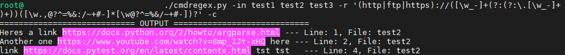
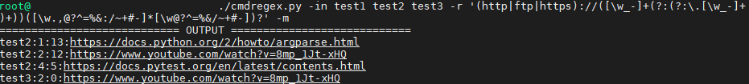

# CmdRegex

## Setup

Make the script executable:  
`chmod +x cmdregex.py`

## Usage

Single quote the regular expression, like seen in the examples below.  
For multiple input files, separate file names with a space.

### Examples:  

#### Input
##### Using files as input:  
`./cmdregex.py -in file1 file2 file3 --regex '\d{1,3}' -c`  
##### Using standard input:  
`cat | ./cmdregex.py --regex '\d{1,3}' -c`  

Type in your text, when finished click **Enter** and then **CTRL+D**.  

Please note:  
Standard input is ignored if **-in** is provided with anything other than "**-**".
#### Output
The output will be displayed in the terminal according to the user's choice of format (colored, underscored, machine or normal text).  

To redirect the output to a file:  
##### Using file input:  
`./cmdregex.py -in input_file.txt --regex '\d{1,3}' -u > output.txt`  
##### Using standard input:  
`cat | ./cmdregex.py --regex '\d{1,3}' -m > output.txt`  

## Tests

Run tests:  
`python2.7 -m pytest`

* [test_validate_regex](tests/test_cmdregex.py) Submits an invalid regular expression as input, and expects `argparse.ArgumentTypeError` to be raised.

* [test_run](tests/test_cmdregex.py) Mimics argparse `args` with no file input and empty `stdin` to anticipate `argparse.ArgumentTypeError` (No input text given).

* [test_format](tests/test_formats.py) Randomly generates input text and a regular expression (consisting of one letter/digit) to compare number of results from vanilla [`Format.format()`](formats.py) function vs python's count method.

* [test_colorize](tests/test_special_formats.py) Calls [`colorize()`](special_formats.py) with an integer as the first argument, anticipating an `AttributeError`.

* [test_underscoreize](tests/test_special_formats.py) and [test_machinize](tests/test_special_formats.py) Perform calls to [`underscoreize()`](special_formats.py) and [`machinize()`](special_formats.py) with valid input, expecting the correct result.

## Additional Information  
For further information regarding customization arguments and general help please see:  
`./cmdregex.py --help`
 
## Notes

In order to distinguish differences between output formats, 
I decided to use a single Format class and  
Dependency injection in the form of passing a process function that's in charge of output to the class constructor (the function is "generated" earlier, based on user input).

This enabled me to conveniently move the special formats to a separate file and provide a much more readable and structured code.

Tests were written using **pytest**.
